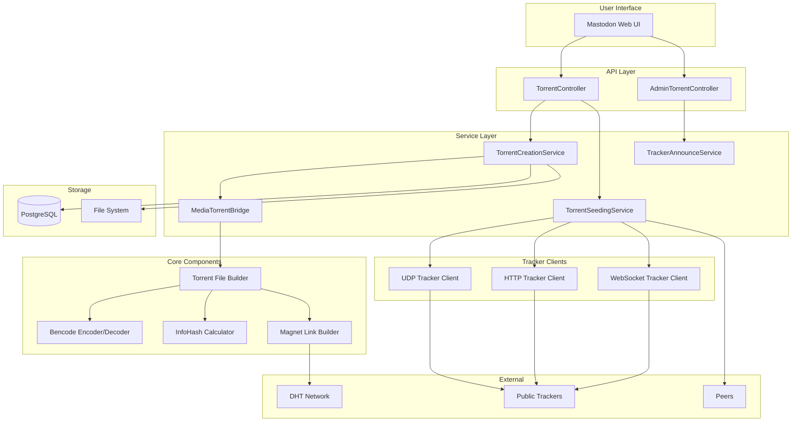
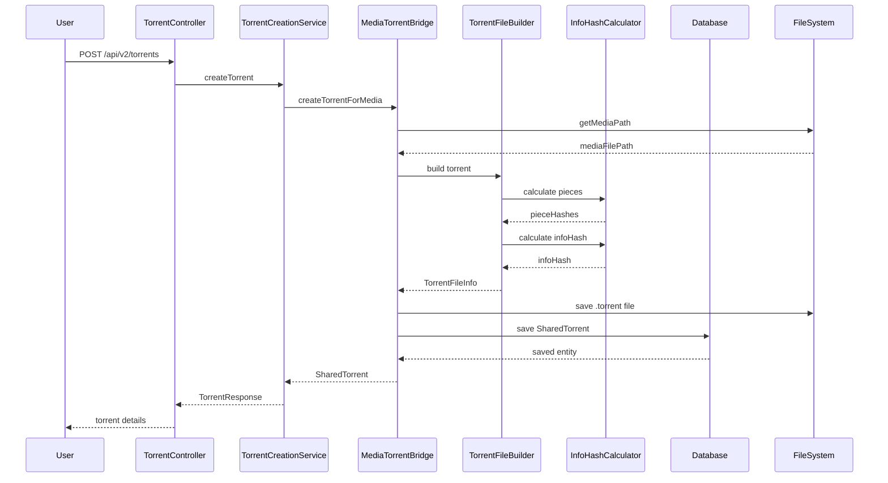
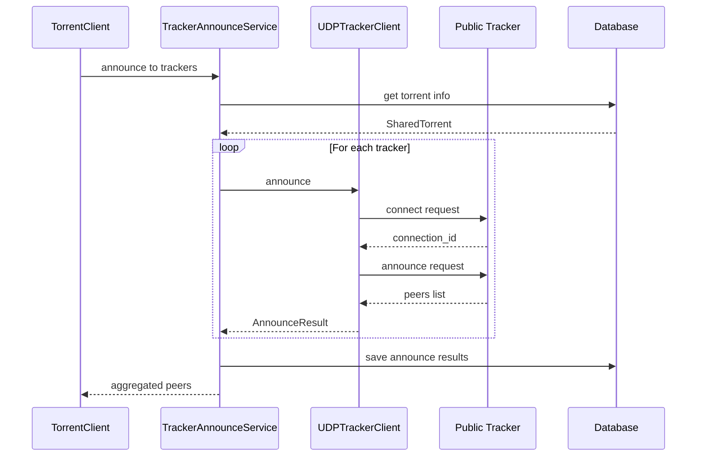

# Torrent Content Sharing Feature Plan

## Overview

This plan outlines the implementation of a feature allowing users to share their content (media attachments) via BitTorrent torrents and magnet links. The feature integrates with the existing `mastodon-torrent` module and follows BitTorrent Enhancement Proposals (BEPs) for standards compliance.

## Goals

1. Enable users to opt-in to share their media content via torrents
2. Generate standards-compliant .torrent files with bencode encoding
3. Create magnet links for DHT-based peer discovery
4. Support uploading to public trackers
5. Integrate seamlessly with existing MediaAttachment workflow

---

## Part 1: Bencode Encoding/Decoding

### 1.1 Overview

Bencode is the encoding format used by BitTorrent for .torrent files. It supports four data types:
- **Integers**: `i<integer>e` (e.g., `i42e`)
- **Strings**: `<length>:<string>` (e.g., `4:spam`)
- **Lists**: `l<elements>e` (e.g., `l4:spam3:egge`)
- **Dictionaries**: `d<key-value pairs>e` (e.g., `d3:bar4:spam3:fooi42ee`)

### 1.2 Implementation

**Package**: `org.joinmastodon.torrent.bencode`

```
mastodon-torrent/src/main/java/org/joinmastodon/torrent/bencode/
├── BencodeDecoder.java          # Decode bencode to Java objects
├── BencodeEncoder.java          # Encode Java objects to bencode
├── BencodeObject.java           # Base interface for bencode types
├── BencodeInteger.java          # Integer type wrapper
├── BencodeString.java           # String type wrapper
├── BencodeList.java             # List type wrapper
└── BencodeDictionary.java       # Dictionary type wrapper
```

### 1.3 Class Design

```java
public class BencodeEncoder {
    
    public byte[] encode(Object value) throws BencodeException {
        ByteArrayOutputStream out = new ByteArrayOutputStream();
        encodeValue(value, out);
        return out.toByteArray();
    }
    
    private void encodeValue(Object value, OutputStream out) {
        if (value instanceof Integer || value instanceof Long) {
            encodeInteger((Number) value, out);
        } else if (value instanceof String) {
            encodeString((String) value, out);
        } else if (value instanceof byte[]) {
            encodeBytes((byte[]) value, out);
        } else if (value instanceof List) {
            encodeList((List<?>) value, out);
        } else if (value instanceof Map) {
            encodeDictionary((Map<?, ?>) value, out);
        }
    }
}

public class BencodeDecoder {
    
    public Object decode(byte[] data) throws BencodeException {
        ByteArrayInputStream in = new ByteArrayInputStream(data);
        return decodeValue(in);
    }
    
    private Object decodeValue(InputStream in) {
        int prefix = in.read();
        return switch (prefix) {
            case 'i' -> decodeInteger(in);
            case 'l' -> decodeList(in);
            case 'd' -> decodeDictionary(in);
            case '0'-'9' -> decodeString(in, prefix);
            default -> throw new BencodeException("Invalid prefix: " + prefix);
        };
    }
}
```

---

## Part 2: Torrent File Creation

### 2.1 Torrent File Structure (BEP 3)

A .torrent file contains a dictionary with the following keys:

| Key | Description |
|-----|-------------|
| `announce` | Primary tracker URL |
| `announce-list` | List of tracker tiers |
| `comment` | Optional comment |
| `created by` | Creator program name |
| `creation date` | Unix timestamp |
| `info` | Info dictionary (file metadata) |
| `url-list` | Web seed URLs (optional) |

### 2.2 Info Dictionary Structure

**Single File Mode**:
```
info = {
    "name": "filename.ext",
    "length": 12345,
    "piece length": 262144,
    "pieces": <SHA-1 hashes concatenated>
}
```

**Multi-File Mode**:
```
info = {
    "name": "directory_name",
    "files": [
        {"length": 123, "path": ["subdir", "file.ext"]},
        ...
    ],
    "piece length": 262144,
    "pieces": <SHA-1 hashes concatenated>
}
```

### 2.3 Implementation

**Package**: `org.joinmastodon.torrent.torrentfile`

```
mastodon-torrent/src/main/java/org/joinmastodon/torrent/torrentfile/
├── TorrentFileBuilder.java      # Build torrent files
├── TorrentFileInfo.java         # Torrent file metadata model
├── InfoDictionary.java          # Info dictionary model
├── PieceHasher.java             # SHA-1 piece hashing
├── PieceSizeCalculator.java     # Calculate optimal piece size
└── TorrentFileWriter.java       # Write .torrent files
```

### 2.4 Piece Size Calculation

Following BEP 3 recommendations:

| Total Size | Piece Size |
|------------|------------|
| < 1 MB | 32 KB |
| 1 MB - 10 MB | 64 KB |
| 10 MB - 100 MB | 256 KB |
| 100 MB - 1 GB | 512 KB |
| 1 GB - 10 GB | 1 MB |
| > 10 GB | 2 MB |

```java
public class PieceSizeCalculator {
    
    public int calculatePieceSize(long totalSize) {
        if (totalSize < 1_000_000) return 32 * 1024;
        if (totalSize < 10_000_000) return 64 * 1024;
        if (totalSize < 100_000_000) return 256 * 1024;
        if (totalSize < 1_000_000_000) return 512 * 1024;
        if (totalSize < 10_000_000_000L) return 1024 * 1024;
        return 2 * 1024 * 1024;
    }
}
```

---

## Part 3: Infohash Generation

### 3.1 Overview

The infohash is a SHA-1 hash of the `info` dictionary in bencoded form. It uniquely identifies the torrent.

### 3.2 Implementation

**Package**: `org.joinmastodon.torrent.hash`

```
mastodon-torrent/src/main/java/org/joinmastodon/torrent/hash/
├── InfoHashCalculator.java      # Calculate SHA-1 infohash
└── HashUtils.java               # General hashing utilities
```

```java
public class InfoHashCalculator {
    
    public String calculateInfoHash(Map<String, Object> infoDictionary) {
        // 1. Bencode the info dictionary
        byte[] bencodedInfo = bencodeEncoder.encode(infoDictionary);
        
        // 2. Calculate SHA-1 hash
        MessageDigest sha1 = MessageDigest.getInstance("SHA-1");
        byte[] hash = sha1.digest(bencodedInfo);
        
        // 3. Return as hex string
        return Hex.toHexString(hash);
    }
    
    public byte[] calculateInfoHashBytes(Map<String, Object> infoDictionary) {
        byte[] bencodedInfo = bencodeEncoder.encode(infoDictionary);
        MessageDigest sha1 = MessageDigest.getInstance("SHA-1");
        return sha1.digest(bencodedInfo);
    }
}
```

---

## Part 4: Magnet Link Generation

### 4.1 Magnet URI Format (BEP 9)

```
magnet:?xt=urn:btih:<infohash>&dn=<name>&tr=<tracker>&xl=<size>
```

**Parameters**:
| Parameter | Description |
|-----------|-------------|
| `xt` | Exact topic - urn:btih: followed by infohash |
| `dn` | Display name (URL encoded) |
| `tr` | Tracker URL (can be multiple) |
| `xl` | Exact length in bytes |
| `xs` | Exact source (optional) |
| `as` | Acceptable source (optional) |
| `kt` | Keywords (optional) |
| `mt` | Manifest topic (optional) |

### 4.2 Implementation

**Package**: `org.joinmastodon.torrent.magnet`

```
mastodon-torrent/src/main/java/org/joinmastodon/torrent/magnet/
├── MagnetLinkBuilder.java       # Build magnet links
├── MagnetLinkParser.java        # Parse magnet links
└── MagnetLink.java              # Magnet link model
```

```java
public class MagnetLinkBuilder {
    
    public String buildMagnetLink(TorrentFileInfo torrentInfo) {
        StringBuilder magnet = new StringBuilder("magnet:?");
        
        // Required: xt (exact topic)
        magnet.append("xt=urn:btih:").append(torrentInfo.getInfoHash());
        
        // Display name
        if (torrentInfo.getName() != null) {
            magnet.append("&dn=").append(urlEncode(torrentInfo.getName()));
        }
        
        // Size
        if (torrentInfo.getTotalSize() > 0) {
            magnet.append("&xl=").append(torrentInfo.getTotalSize());
        }
        
        // Trackers
        for (String tracker : torrentInfo.getTrackers()) {
            magnet.append("&tr=").append(urlEncode(tracker));
        }
        
        return magnet.toString();
    }
}
```

---

## Part 5: Public Tracker Integration

### 5.1 Overview

Public trackers allow announcing torrents without registration. Common protocols:
- **UDP Trackers**: `udp://tracker.example.com:1337/announce`
- **HTTP Trackers**: `http://tracker.example.com:6969/announce`
- **WebTorrent Trackers**: `wss://tracker.example.com:443/announce`

### 5.2 Public Tracker List

Recommended public trackers for inclusion:

```
# UDP Trackers
udp://tracker.opentrackr.org:1337/announce
udp://open.stealth.si:80/announce
udp://tracker.torrent.eu.org:451/announce
udp://tracker.bittor.pw:1337/announce
udp://public.popcorn-tracker.org:6969/announce
udp://tracker.dler.org:6969/announce
udp://exodus.desync.com:6969/announce

# HTTP Trackers
http://tracker.opentrackr.org:1337/announce
http://tracker.openbittorrent.com:80/announce

# WebTorrent Trackers (for browser peers)
wss://tracker.openwebtorrent.com:443/announce
wss://tracker.btorrent.xyz:443/announce
```

### 5.3 Tracker Announce Protocol

**UDP Tracker Protocol** (BEP 15):

```
1. Connect Request:
   - protocol_id: 0x41727101980
   - action: 0 (connect)
   - transaction_id: random

2. Connect Response:
   - action: 0
   - transaction_id: matches request
   - connection_id: used for subsequent requests

3. Announce Request:
   - connection_id: from connect response
   - action: 1 (announce)
   - transaction_id: random
   - info_hash: 20 bytes
   - peer_id: 20 bytes
   - downloaded: 8 bytes
   - left: 8 bytes
   - uploaded: 8 bytes
   - event: 0-3 (none, completed, started, stopped)
   - ip_address: 0 (auto)
   - key: random
   - num_want: -1 (default)
   - port: listening port

4. Announce Response:
   - action: 1
   - transaction_id: matches request
   - interval: seconds between announces
   - leechers: count
   - seeders: count
   - peers: 6 bytes each (4 IP + 2 port)
```

### 5.4 Implementation

**Package**: `org.joinmastodon.torrent.tracker`

```
mastodon-torrent/src/main/java/org/joinmastodon/torrent/tracker/
├── TrackerClient.java           # Abstract tracker client
├── UdpTrackerClient.java        # UDP tracker protocol
├── HttpTrackerClient.java       # HTTP tracker protocol
├── WebSocketTrackerClient.java  # WebTorrent tracker
├── TrackerAnnounceResult.java   # Announce response model
├── TrackerStatus.java           # Tracker status model
└── PublicTrackerList.java       # Built-in public trackers
```

### 5.5 Tracker Client Implementation

```java
public class UdpTrackerClient extends TrackerClient {
    
    public CompletableFuture<TrackerAnnounceResult> announce(
            String trackerUrl,
            byte[] infoHash,
            byte[] peerId,
            long downloaded,
            long left,
            long uploaded,
            AnnounceEvent event,
            int port) {
        
        // 1. Parse tracker URL
        InetSocketAddress address = parseTrackerUrl(trackerUrl);
        
        // 2. Send connect request
        return sendConnectRequest(address)
            .thenCompose(connectionId -> 
                // 3. Send announce request
                sendAnnounceRequest(
                    address, connectionId, infoHash, peerId,
                    downloaded, left, uploaded, event, port
                )
            );
    }
}
```

### 5.6 Scrape Support

Trackers also support scraping for aggregate statistics:

```java
public class TrackerScraper {
    
    public CompletableFuture<ScrapeResult> scrape(
            String trackerUrl, 
            List<byte[]> infoHashes) {
        // Returns seeders, leechers, completed counts for each infohash
    }
}
```

---

## Part 6: Database Schema

### 6.1 New Tables

```sql
-- Torrent metadata for shared content
CREATE TABLE shared_torrents (
    id BIGSERIAL PRIMARY KEY,
    
    -- Content reference
    media_attachment_id BIGINT REFERENCES media_attachments(id),
    account_id BIGINT NOT NULL REFERENCES accounts(id),
    
    -- Torrent identification
    info_hash VARCHAR(40) UNIQUE NOT NULL,      -- SHA-1 hex string
    
    -- Torrent metadata
    torrent_name VARCHAR(255),
    total_size BIGINT NOT NULL,
    piece_size INTEGER NOT NULL,
    piece_count INTEGER NOT NULL,
    
    -- Generated files
    torrent_file_path VARCHAR(512),              -- Path to .torrent file
    magnet_link TEXT,                            -- Full magnet URI
    
    -- Trackers
    trackers TEXT[],                             -- Array of tracker URLs
    
    -- Seeding status
    seeding_enabled BOOLEAN DEFAULT true,
    seeding_status VARCHAR(20) DEFAULT 'ACTIVE', -- ACTIVE, PAUSED, STOPPED
    
    -- Statistics
    total_uploaded BIGINT DEFAULT 0,
    total_downloaded BIGINT DEFAULT 0,
    seed_count INTEGER DEFAULT 0,
    peer_count INTEGER DEFAULT 0,
    
    -- Timestamps
    created_at TIMESTAMP DEFAULT NOW(),
    updated_at TIMESTAMP DEFAULT NOW(),
    last_announce_at TIMESTAMP,
    
    -- Constraints
    UNIQUE(media_attachment_id)
);

CREATE INDEX idx_shared_torrents_info_hash ON shared_torrents(info_hash);
CREATE INDEX idx_shared_torrents_account ON shared_torrents(account_id);
CREATE INDEX idx_shared_torrents_seeding ON shared_torrents(seeding_status);

-- Tracker announce history
CREATE TABLE tracker_announces (
    id BIGSERIAL PRIMARY KEY,
    
    shared_torrent_id BIGINT REFERENCES shared_torrents(id),
    tracker_url VARCHAR(512) NOT NULL,
    
    -- Announce result
    status VARCHAR(20) NOT NULL,                 -- SUCCESS, FAILED, TIMEOUT
    seeders INTEGER,
    leechers INTEGER,
    peers_found INTEGER,
    
    -- Timing
    announced_at TIMESTAMP DEFAULT NOW(),
    response_time_ms INTEGER,
    
    -- Error info
    error_message TEXT
);

CREATE INDEX idx_tracker_announces_torrent ON tracker_announces(shared_torrent_id);
CREATE INDEX idx_tracker_announces_time ON tracker_announces(announced_at);

-- User torrent preferences
CREATE TABLE account_torrent_settings (
    id BIGSERIAL PRIMARY KEY,
    account_id BIGINT UNIQUE NOT NULL REFERENCES accounts(id),
    
    -- Sharing preferences
    share_via_torrent BOOLEAN DEFAULT false,     -- Opt-in for torrent sharing
    auto_seed_uploads BOOLEAN DEFAULT true,      -- Auto-seed uploaded content
    
    -- Seeding limits
    max_seeding_ratio DECIMAL(4,2) DEFAULT 2.0,  -- Stop at ratio
    max_seeding_hours INTEGER DEFAULT 168,       -- Stop after hours (1 week)
    max_upload_rate VARCHAR(20) DEFAULT '1MB',   -- KB/s or human readable
    
    -- Privacy
    anonymous_seeding BOOLEAN DEFAULT false,     -- Hide peer ID attribution
    
    created_at TIMESTAMP DEFAULT NOW(),
    updated_at TIMESTAMP DEFAULT NOW()
);
```

### 6.2 Entity Classes

**Package**: `org.joinmastodon.torrent.entity`

```java
@Entity
@Table(name = "shared_torrents")
public class SharedTorrent {
    @Id
    @GeneratedValue(strategy = GenerationType.IDENTITY)
    private Long id;
    
    @OneToOne
    @JoinColumn(name = "media_attachment_id")
    private MediaAttachment mediaAttachment;
    
    @ManyToOne
    @JoinColumn(name = "account_id", nullable = false)
    private Account account;
    
    @Column(name = "info_hash", unique = true, nullable = false, length = 40)
    private String infoHash;
    
    @Column(name = "torrent_name")
    private String torrentName;
    
    @Column(name = "total_size", nullable = false)
    private Long totalSize;
    
    @Column(name = "piece_size", nullable = false)
    private Integer pieceSize;
    
    @Column(name = "piece_count", nullable = false)
    private Integer pieceCount;
    
    @Column(name = "torrent_file_path")
    private String torrentFilePath;
    
    @Column(name = "magnet_link", columnDefinition = "TEXT")
    private String magnetLink;
    
    @ElementCollection
    @Column(name = "trackers")
    private List<String> trackers = new ArrayList<>();
    
    @Column(name = "seeding_enabled")
    private boolean seedingEnabled = true;
    
    @Enumerated(EnumType.STRING)
    @Column(name = "seeding_status", length = 20)
    private SeedingStatus seedingStatus = SeedingStatus.ACTIVE;
    
    // ... additional fields, getters, setters
}
```

---

## Part 7: API Endpoints

### 7.1 User API Endpoints

| Endpoint | Method | Description |
|----------|--------|-------------|
| `/api/v2/torrents` | GET | List user's shared torrents |
| `/api/v2/torrents` | POST | Create torrent from media |
| `/api/v2/torrents/:infoHash` | GET | Get torrent details |
| `/api/v2/torrents/:infoHash` | DELETE | Stop sharing and remove torrent |
| `/api/v2/torrents/:infoHash/magnet` | GET | Get magnet link |
| `/api/v2/torrents/:infoHash/torrent` | GET | Download .torrent file |
| `/api/v2/torrents/:infoHash/pause` | POST | Pause seeding |
| `/api/v2/torrents/:infoHash/resume` | POST | Resume seeding |
| `/api/v2/torrents/settings` | GET | Get user torrent settings |
| `/api/v2/torrents/settings` | PUT | Update user torrent settings |

### 7.2 Admin API Endpoints

| Endpoint | Method | Description |
|----------|--------|-------------|
| `/api/v2/admin/torrents` | GET | List all shared torrents |
| `/api/v2/admin/torrents/stats` | GET | Get torrent statistics |
| `/api/v2/admin/torrents/settings` | GET/PUT | Global torrent settings |
| `/api/v2/admin/torrents/trackers` | GET | List configured trackers |
| `/api/v2/admin/torrents/trackers` | POST | Add tracker |
| `/api/v2/admin/torrents/trackers/:id` | DELETE | Remove tracker |

### 7.3 API Request/Response Models

**Create Torrent Request**:
```json
{
  "media_attachment_id": "123456789",
  "trackers": ["udp://tracker.example.com:1337/announce"],
  "include_web_seeds": true,
  "custom_comment": "Shared via Mastodon"
}
```

**Torrent Response**:
```json
{
  "id": "1",
  "info_hash": "5dee9d8f3c8e4a1b9c7d6e5f4a3b2c1d0e9f8a7b",
  "name": "image.jpg",
  "total_size": 1048576,
  "piece_size": 32768,
  "piece_count": 32,
  "magnet_link": "magnet:?xt=urn:btih:5dee9d8f3c8e4a1b9c7d6e5f4a3b2c1d0e9f8a7b&dn=image.jpg&xl=1048576",
  "torrent_url": "https://example.social/api/v2/torrents/5dee9d8f.../torrent",
  "seeding_status": "ACTIVE",
  "statistics": {
    "uploaded": 5242880,
    "downloaded": 1048576,
    "ratio": 5.0,
    "seeders": 3,
    "leechers": 1
  },
  "created_at": "2026-02-21T00:00:00Z"
}
```

---

## Part 8: Integration with MediaAttachment

### 8.1 MediaAttachment Extension

Add optional torrent fields to MediaAttachment:

```java
// In MediaAttachment.java
@Column(name = "torrent_enabled")
private boolean torrentEnabled = false;

@OneToOne(mappedBy = "mediaAttachment", cascade = CascadeType.ALL)
private SharedTorrent sharedTorrent;
```

### 8.2 MediaTorrentBridge Service

**Package**: `org.joinmastodon.torrent.integration`

```java
@Service
public class MediaTorrentBridge {
    
    private final TorrentFileBuilder torrentBuilder;
    private final SharedTorrentRepository torrentRepository;
    private final StorageService storageService;
    
    /**
     * Create a torrent for a media attachment.
     */
    public SharedTorrent createTorrentForMedia(
            MediaAttachment media,
            List<String> additionalTrackers,
            boolean enableSeeding) {
        
        // 1. Get media file path
        Path mediaPath = storageService.getMediaPath(media.getStorageKey());
        
        // 2. Build torrent file
        TorrentFileInfo torrentInfo = torrentBuilder.build(builder -> builder
            .name(media.getFileName())
            .file(mediaPath)
            .comment("Shared via " + serverDomain)
            .trackers(getDefaultTrackers())
            .additionalTrackers(additionalTrackers)
            .createdBy("mastodon-torrent")
        );
        
        // 3. Save .torrent file
        Path torrentPath = saveTorrentFile(torrentInfo);
        
        // 4. Generate magnet link
        String magnetLink = magnetLinkBuilder.build(torrentInfo);
        
        // 5. Create database record
        SharedTorrent sharedTorrent = new SharedTorrent();
        sharedTorrent.setMediaAttachment(media);
        sharedTorrent.setAccount(media.getAccount());
        sharedTorrent.setInfoHash(torrentInfo.getInfoHash());
        sharedTorrent.setTorrentName(torrentInfo.getName());
        sharedTorrent.setTotalSize(torrentInfo.getTotalSize());
        sharedTorrent.setPieceSize(torrentInfo.getPieceSize());
        sharedTorrent.setPieceCount(torrentInfo.getPieceCount());
        sharedTorrent.setTorrentFilePath(torrentPath.toString());
        sharedTorrent.setMagnetLink(magnetLink);
        sharedTorrent.setTrackers(torrentInfo.getTrackers());
        sharedTorrent.setSeedingEnabled(enableSeeding);
        
        return torrentRepository.save(sharedTorrent);
    }
    
    /**
     * Start seeding a torrent.
     */
    public void startSeeding(SharedTorrent torrent) {
        torrentClient.addTorrentFile(Path.of(torrent.getTorrentFilePath()));
        torrent.setSeedingStatus(SeedingStatus.ACTIVE);
        torrentRepository.save(torrent);
    }
    
    /**
     * Stop seeding a torrent.
     */
    public void stopSeeding(SharedTorrent torrent) {
        torrentClient.remove(torrent.getInfoHash(), false);
        torrent.setSeedingStatus(SeedingStatus.STOPPED);
        torrentRepository.save(torrent);
    }
}
```

---

## Part 9: Module Structure

### 9.1 Complete Package Layout

```
mastodon-torrent/
├── pom.xml
└── src/main/java/org/joinmastodon/torrent/
    ├── config/
    │   ├── TorrentConfiguration.java      # Spring configuration
    │   └── TorrentProperties.java         # (existing) Configuration properties
    ├── bencode/
    │   ├── BencodeDecoder.java
    │   ├── BencodeEncoder.java
    │   ├── BencodeException.java
    │   └── BencodeObject.java
    ├── hash/
    │   ├── InfoHashCalculator.java
    │   └── HashUtils.java
    ├── torrentfile/
    │   ├── TorrentFileBuilder.java
    │   ├── TorrentFileInfo.java
    │   ├── InfoDictionary.java
    │   ├── PieceHasher.java
    │   ├── PieceSizeCalculator.java
    │   └── TorrentFileWriter.java
    ├── magnet/
    │   ├── MagnetLinkBuilder.java
    │   ├── MagnetLinkParser.java
    │   └── MagnetLink.java
    ├── tracker/
    │   ├── TrackerClient.java
    │   ├── UdpTrackerClient.java
    │   ├── HttpTrackerClient.java
    │   ├── WebSocketTrackerClient.java
    │   ├── TrackerAnnounceResult.java
    │   ├── TrackerStatus.java
    │   └── PublicTrackerList.java
    ├── core/
    │   ├── TorrentClient.java             # (existing)
    │   ├── TorrentHandle.java             # (existing)
    │   ├── TorrentInfo.java               # (existing)
    │   └── TorrentStatus.java             # (existing)
    ├── entity/
    │   ├── SharedTorrent.java
    │   ├── TrackerAnnounce.java
    │   └── AccountTorrentSettings.java
    ├── repository/
    │   ├── SharedTorrentRepository.java
    │   ├── TrackerAnnounceRepository.java
    │   └── AccountTorrentSettingsRepository.java
    ├── service/
    │   ├── TorrentCreationService.java
    │   ├── TorrentSeedingService.java
    │   ├── TrackerAnnounceService.java
    │   └── TorrentStatisticsService.java
    ├── integration/
    │   ├── MediaTorrentBridge.java
    │   └── ContentSeeder.java
    └── api/
        ├── TorrentController.java
        ├── AdminTorrentController.java
        └── dto/
            ├── CreateTorrentRequest.java
            ├── TorrentResponse.java
            ├── TorrentStatisticsResponse.java
            └── TorrentSettingsRequest.java
```

---

## Part 10: Configuration

### 10.1 Application Properties

```yaml
mastodon:
  torrent:
    enabled: true
    
    # Content sharing settings
    content-sharing:
      enabled: true
      auto-create-for-large-files: true
      large-file-threshold: 10MB
      default-trackers:
        - udp://tracker.opentrackr.org:1337/announce
        - udp://open.stealth.si:80/announce
        - udp://tracker.torrent.eu.org:451/announce
      include-webtorrent-trackers: true
      webtorrent-trackers:
        - wss://tracker.openwebtorrent.com:443/announce
        - wss://tracker.btorrent.xyz:443/announce
    
    # Torrent file settings
    torrent-file:
      piece-size: auto          # auto or specific size like 256KB
      created-by: "mastodon-torrent"
      include-creation-date: true
      private-torrent: false
    
    # Seeding settings
    seeding:
      enabled: true
      default-ratio-limit: 2.0
      default-time-limit: 168h
      max-concurrent-seeds: 50
    
    # Tracker settings
    tracker:
      announce-interval: 1800   # 30 minutes
      min-announce-interval: 300
      timeout: 15000            # 15 seconds
      retry-count: 3
    
    # DHT settings (for magnet links)
    dht:
      enabled: true
      port: 6881
      bootstrap-nodes:
        - router.bittorrent.com:6881
        - router.utorrent.com:6881
        - dht.transmissionbt.com:6881
```

---

## Part 11: Security Considerations

### 11.1 Privacy

1. **Opt-in by default**: Users must explicitly enable torrent sharing
2. **Peer ID attribution**: Option for anonymous seeding
3. **IP exposure warning**: Notify users that their IP will be visible to peers
4. **Content control**: Users can stop sharing at any time

### 11.2 Content Integrity

1. **Hash verification**: All pieces verified via SHA-1
2. **Infohash uniqueness**: Prevents content spoofing
3. **Tracker validation**: Only use trusted trackers

### 11.3 Rate Limiting

1. **Upload limits**: Configurable per-user upload rate limits
2. **Connection limits**: Maximum concurrent connections
3. **Announce limits**: Respect tracker minimum intervals

---

## Part 12: Implementation Phases

### Phase 1: Core Infrastructure
- [ ] Implement bencode encoder/decoder
- [ ] Implement infohash calculator
- [ ] Implement piece hasher
- [ ] Implement torrent file builder

### Phase 2: Magnet Links
- [ ] Implement magnet link builder
- [ ] Implement magnet link parser
- [ ] Add DHT support for magnet resolution

### Phase 3: Tracker Integration
- [ ] Implement UDP tracker client
- [ ] Implement HTTP tracker client
- [ ] Implement WebSocket tracker client
- [ ] Add public tracker list

### Phase 4: Database & Entities
- [ ] Create database migrations
- [ ] Implement entity classes
- [ ] Implement repositories

### Phase 5: Service Layer
- [ ] Implement TorrentCreationService
- [ ] Implement TorrentSeedingService
- [ ] Implement TrackerAnnounceService
- [ ] Implement MediaTorrentBridge

### Phase 6: API Layer
- [ ] Implement user API endpoints
- [ ] Implement admin API endpoints
- [ ] Add API documentation

### Phase 7: Integration
- [ ] Integrate with MediaAttachment
- [ ] Add UI for torrent settings
- [ ] Add torrent links to media display

---

## Mermaid Diagrams

### Architecture Overview



### Torrent Creation Flow



### Tracker Announce Flow



---

## Dependencies

### Maven Dependencies to Add

```xml
<!-- No additional dependencies required for core functionality -->
<!-- Java standard library provides SHA-1 via MessageDigest -->

<!-- Optional: For async HTTP tracker requests -->
<dependency>
    <groupId>org.springframework.boot</groupId>
    <artifactId>spring-boot-starter-webflux</artifactId>
</dependency>

<!-- For testing -->
<dependency>
    <groupId>org.springframework.boot</groupId>
    <artifactId>spring-boot-starter-test</artifactId>
    <scope>test</scope>
</dependency>
```

---

## Testing Strategy

### Unit Tests
- Bencode encoding/decoding
- Infohash calculation
- Magnet link generation
- Piece size calculation

### Integration Tests
- Torrent file creation
- Tracker announce protocol
- Database operations
- API endpoints

### Performance Tests
- Large file hashing
- Concurrent tracker announces
- Seeding performance

---

## Success Criteria

1. **Standards Compliance**: Generated .torrent files pass validation against BEP 3
2. **Magnet Compatibility**: Magnet links work with standard BitTorrent clients
3. **Tracker Support**: Successfully announce to at least 3 public trackers
4. **User Adoption**: Clear opt-in flow with privacy warnings
5. **Performance**: No degradation of primary Mastodon functionality
